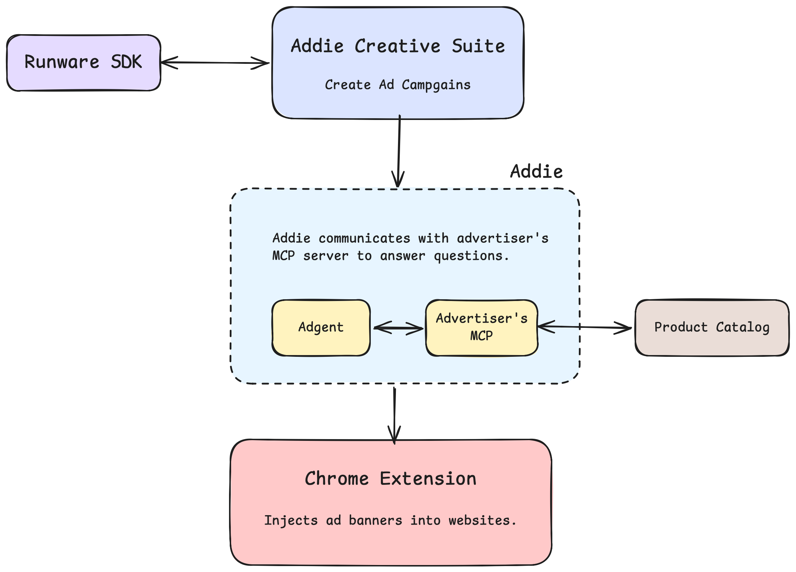

# Adgent

Adgent is an agentic advertising system that injects interactive, AI-powered ad units directly into social and tech news feeds. Rather than static banner ads, Adgent embeds a conversational shopping assistant — "Addie" — that lets users ask questions about the advertised product without leaving the page.

The system is composed of four parts: a campaign creative suite for advertisers, a Python backend that runs a Claude AI agent, an MCP server that serves as a product catalog tool layer, and a Chrome extension that injects the ad UI into supported websites.

---



---

## How It Works

### The Full Flow

1. An advertiser opens the **Creative Suite** (React app) and either uploads an existing ad image or generates one with AI using the Runware image generation API.
2. They enter product details (name, URL, display text) and select which websites to target.
3. Clicking "Launch Campaign" calls the backend's `/api/campaign/launch` endpoint, which writes `products.json` and `campaign.json` directly into the Chrome extension directory.
4. With the extension installed and the server running, a user visits a supported website (Reddit, TechCrunch, Hacker News, or Stack Overflow).
5. The extension's `content.js` reads `products.json`, detects the current site against `campaign.json`, and injects native-looking ad cards into the post feed at a configured interval.
6. Each ad card displays the product thumbnail and pre-generated suggestion chips.
7. When the user types a question or clicks a chip and hits "Ask", the extension POSTs to the local backend at `localhost:8787`.
8. The backend spins up the Claude Opus agent, which spawns the MCP server as a subprocess and enters a tool-use loop — querying product data, checking availability, managing a cart — until it calls the `final_response` tool with a structured answer.
9. The response renders in a dockable side panel alongside the page, with follow-up action chips and a product image.

---

## Components

### `adgent/` — Python Backend and AI Agent

A FastAPI server running on port `8787`. It is the bridge between the Chrome extension and Claude.

**Endpoints:**

| Method | Path | Purpose |
|--------|------|---------|
| POST | `/api/ad-agent/query` | Runs the full Claude + MCP agentic loop for a user prompt |
| POST | `/api/ad-agent/suggest` | Generates 4 fast suggestion chips for a product (uses Haiku) |
| POST | `/api/campaign/launch` | Writes `products.json` and `campaign.json` to the extension directory |
| GET | `/health` | Health check |

**`agent.py` — The AI Agent**

`run_query()` runs the full agentic loop:
- Spawns the MCP server as a child process over stdio.
- Fetches the list of available tools from the MCP server and appends a `final_response` structured output tool.
- Calls Claude Opus in a loop, forwarding tool calls to the MCP server and appending results back to the message history.
- The loop terminates when Claude calls `final_response`, returning a `message`, a list of `next_steps` action chips, and an optional `product_image` URL.

`get_suggestions()` is a lighter path that uses Claude Haiku to generate contextual question chips for a product on ad load. For known GPU product families (RTX 5090, 5080, etc.) it skips the API call and returns static suggestions instantly.

---

### `mcp_server/` — NVIDIA GPU Store MCP Server

An MCP server built with `FastMCP` that wraps a local catalog of 86 NVIDIA GPU products from brands including ASUS, GIGABYTE, MSI, NVIDIA, PNY, and ZOTAC. The catalog covers RTX 30, 40, and 50 series cards with real image URLs, retailer links, pricing, and availability data.

The agent calls these tools during its reasoning loop:

| Tool | Description |
|------|-------------|
| `list_products` | Lists all products with price and availability |
| `search_products` | Full-text search across name, brand, specs, and offer text |
| `get_product_details` | Full product record including specs, retailers, and image URL |
| `get_product_specs` | Returns only the technical specification fields |
| `get_product_image` | Returns the product image URL |
| `filter_products` | Filters by price range, brand, GPU model, stock, or deal status |
| `compare_products` | Side-by-side comparison of two or more GPUs |
| `check_availability` | Live stock status across all tracked retailers |
| `get_retailers` | Lists every retailer with price and purchase link |
| `find_cheapest` | Returns the lowest-priced available retailer |
| `list_brands` | All brands in the catalog |
| `list_gpu_models` | All GPU model families in the catalog |
| `get_current_offers` | Products with active promotional offers or game bundles |
| `get_best_sellers` | Best-seller flagged products |
| `add_to_cart` | Adds a product to the in-session shopping cart |
| `remove_from_cart` | Removes an item from the cart |
| `update_cart_quantity` | Updates item quantity (0 to remove) |
| `view_cart` | Shows cart contents with subtotals and grand total |
| `checkout` | Confirms the order, clears the cart, and returns retailer purchase links |

The MCP server is started as a subprocess by the agent on each query. The agent communicates with it over stdio using the MCP protocol.

---

### `chrome-extension/` — "Addie Demo Banner"

A Manifest V3 Chrome extension that injects Addie into the page.

**`content.js`** is the main script. On load it:
1. Detects the current site (Reddit, TechCrunch, Hacker News, Stack Overflow).
2. Reads `campaign.json` to confirm the site is targeted.
3. Reads `products.json` to get the list of products to advertise.
4. Reads the browser's cookie string to build a lightweight profile (theme preference, returning user signals).
5. Walks the DOM looking for post/article elements using site-specific selectors.
6. Injects a `<article class="addie-feed-card">` after every N-th post, cycling through the product list.

Each feed card contains a product thumbnail, a headline, pre-loaded suggestion chips, and a free-text input. When the user submits a query, `content.js` calls `http://localhost:8787/api/ad-agent/query` and renders the structured Markdown response inline and in a dockable side panel.

The side panel supports multiple tabbed sessions — one per ad card the user has interacted with — so users can compare products across different conversations simultaneously.

A `MutationObserver` watches for DOM changes (infinite scroll, route changes) and re-runs ad injection as new posts appear.

**Key files:**

| File | Purpose |
|------|---------|
| `manifest.json` | Extension manifest — permissions, host matches, content script declarations |
| `content.js` | Feed injection, UI rendering, backend communication |
| `background.js` | Service worker |
| `styles.css` | Styles for the feed card and side panel |
| `products.json` | Product catalog written by the backend on campaign launch |
| `campaign.json` | Target site list written by the backend on campaign launch |
| `images/` | Product thumbnail images saved by the backend |

---

### `adgent-creative-suite/` — Campaign Creation UI

A React + Vite + Tailwind application for advertisers. It provides a three-step flow:

**Step 1 — Dashboard (`/`)**
Choose between uploading an existing ad image or generating one with AI.

**Step 2 — Create (`/campaign/new`)**
- **Upload mode:** Drag and drop an image file.
- **Generate mode:** Enter a campaign name, an optional set of reference product images, and a descriptive prompt. The UI calls the Runware image generation API (via `@runware/sdk-js`) to produce a 1376x768 ad image. Reference images are uploaded to Runware and passed as reference inputs to guide the output. A fallback model is tried automatically if the configured model fails.

The generated or uploaded image is stored in `sessionStorage` and passed to the next step.

**Step 3 — Target (`/campaign/target`)**
Enter product name, product URL, optional display text, and select which websites to target. Clicking "Launch Campaign" sends the product data and image (as a base64 data URL if AI-generated) to `POST /api/campaign/launch`. The backend saves the image to the extension's `images/` directory and writes updated `products.json` and `campaign.json` files.

---

## Local Setup

### Requirements

- Python 3.11+ and [uv](https://github.com/astral-sh/uv)
- Node.js 18+ and npm (or bun)
- Google Chrome

### 1. Install Python dependencies

```bash
uv sync
```

### 2. Configure environment variables

Copy `.env.example` to `.env` in the repo root (for the Python backend) and in `adgent-creative-suite/` (for the frontend), then fill in your keys:

**Root `.env` (backend):**
```
ANTHROPIC_API_KEY=sk-ant-...
```

**`adgent-creative-suite/.env` (frontend):**
```
VITE_RUNWARE_API_KEY=your-runware-api-key
VITE_RUNWARE_IMAGE_MODEL=google:4@3   # optional, this is the default
```

### 3. Start the backend server

```bash
uv run python -m adgent.server
```

The server starts on `http://localhost:8787`.

### 4. Start the creative suite

```bash
cd adgent-creative-suite
npm install
npm run dev
```

The UI opens at `http://localhost:5173`.

### 5. Load the Chrome extension

1. Open `chrome://extensions`
2. Enable "Developer mode"
3. Click "Load unpacked" and select the `chrome-extension/` directory

Navigate to Reddit, TechCrunch, Hacker News, or Stack Overflow. Ad cards will appear in the feed once a campaign has been launched via the creative suite.

### API Keys Required

| Key | Where to get it | Used for |
|-----|----------------|---------|
| `ANTHROPIC_API_KEY` | [console.anthropic.com](https://console.anthropic.com) | Claude Opus (agent) and Claude Haiku (suggestions) |
| `VITE_RUNWARE_API_KEY` | [runware.ai](https://runware.ai) | AI ad image generation in the creative suite |

---

## Project Structure

```
Adgent/
  adgent/                    # Python backend — FastAPI server and Claude agent
    server.py                # HTTP API (port 8787)
    agent.py                 # Claude + MCP agentic loop and suggestion generator
  mcp_server/                # MCP server — NVIDIA GPU Store tool layer
    server.py                # FastMCP server with 15+ product tools
    store.py                 # Catalog query logic
    cart.py                  # In-session shopping cart
  chrome-extension/          # Chrome extension
    manifest.json
    content.js               # Feed injection and UI
    background.js
    styles.css
    products.json            # Written by the backend on campaign launch
    campaign.json            # Written by the backend on campaign launch
    images/                  # Product thumbnails
  adgent-creative-suite/     # React campaign creation UI
    src/
      pages/
        Dashboard.tsx        # Mode selection
        CampaignCreate.tsx   # Ad upload or AI generation
        CampaignTarget.tsx   # Targeting and campaign launch
  nvidia-catalog/            # Raw GPU product catalog data
  nike-catalog/              # Additional catalog data
  pyproject.toml             # Python project config
```
